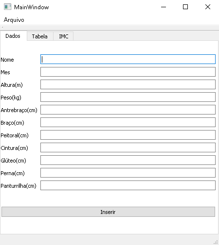
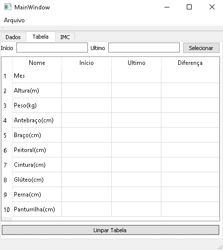
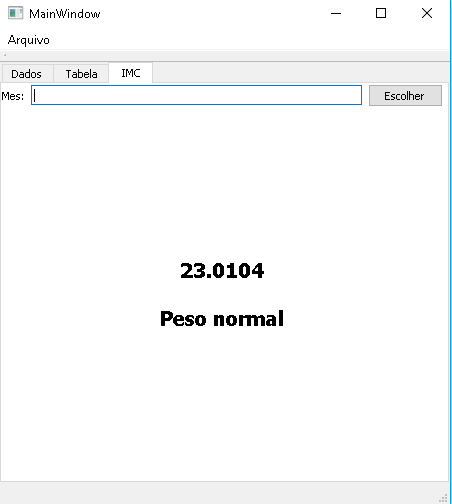

# Acompanhamento Físico
### Código da aplicação desenvolvida em [QT](http://www.qt.io) para acompanhamento físico

A aplicação permite que o usuário acompanhe seu crescimento/decrescimento de suas medidas corporais assim como seu Índice de Massa Corporal (IMC).

Na aba "Dados" Deve-se inserir as medidas do corpo da pessoa clicando em "Inserir". Ao serem iseridos pela primeira vez o cadastro deverá possuir o número do mês como 0. Após isso vá em "Arquivos" e reigstre seus dados, se não fopr a primeira vez, em "Arquivos" clique em "Carregar", após isso selecione o arquivo utilizado para salvar seus dados, continue inserindo seus dados na aba "Dados" e finalmente vá em "Salvar" e selecione o arquivo ja selecionado anteriormente para salvar sue novos dados.

Após clicar em "Inserir" será carregado na aba "Tabela" os valores do mês 0 (seu cadastro) e os últimos dados inseridos mostrando a diferença entre eles, sendo possível alternar os meses na tabela (inserindo os meses desejados e clicando em "Selecionar") como também alterar os valores caso tenha inserido algum incorretamente clicando duas vezes no valor desejado.

Na aba "IMC" aparecerá o resultado de seu IMC como também seu diagnóstico podendo também ser alternado inserindo o mês desejado e clicando em "Escolher".

### Observações

Aparecem os meses dois a dois para evitar sobre carga de infomações pois a longo prazo exitiriam muitos meses a serem exibidos.

Não possui a diferença entre os IMCs pois a relação não é tão direta como as medidas são.
